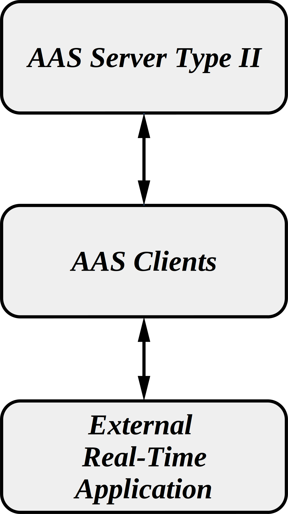

# Basics AAS Clients
In this repository, basic scripts for interaction with AAS Servers are going to be defined. All of these scripts are just generated for a proof of concept of the different alternatives for data and information consumption and for testing the available AAS Servers tools. 

The idea of this repo is to collect different alternatives for data and information consumption from different AAS Servers using different programming languages and I4.0-Compliant Communication procotols, such as: AMQP, HTTP, MQTT and OPC UA

## Implementation Schema

### CrystalClient - HTTP
* Link to the script => [Link](https://github.com/MartinAlejandroBaer/httpAASupdater/tree/main/CrystalClient)
* In this case, a simple http client using the Crystal programming language and its standar HTTP library. Other libraries such as "json", "time" and "base64" are also utilised. 
* The http client in this case connects with a standar HTTP Server created following the specifications "Specification of the Asset Administration Shell Part 2: Application Programming Interfaces – IDTA Number: 01002" (See [Link](https://industrialdigitaltwin.io/aas-specifications/IDTA-01002/v3.1.3/index.html))
* For the deploymenf ot the AAS, the tool "FA³ST Service" was testet (See [Link](https://faaast-service.readthedocs.io/en/latest/))
